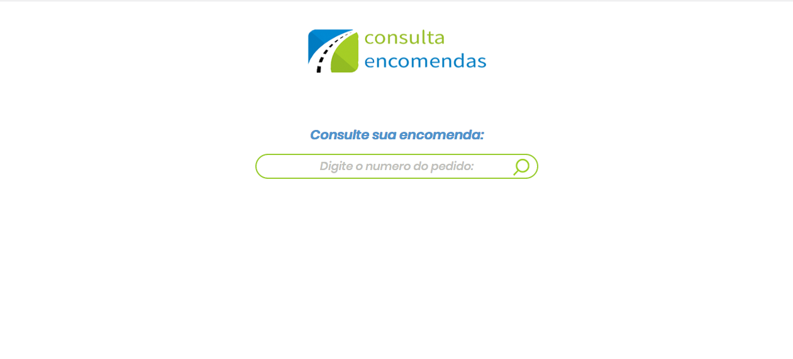
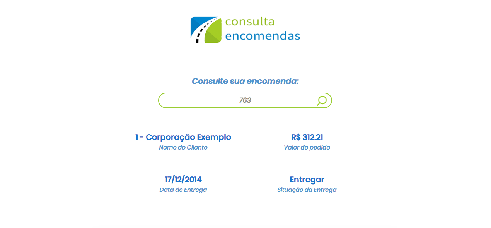
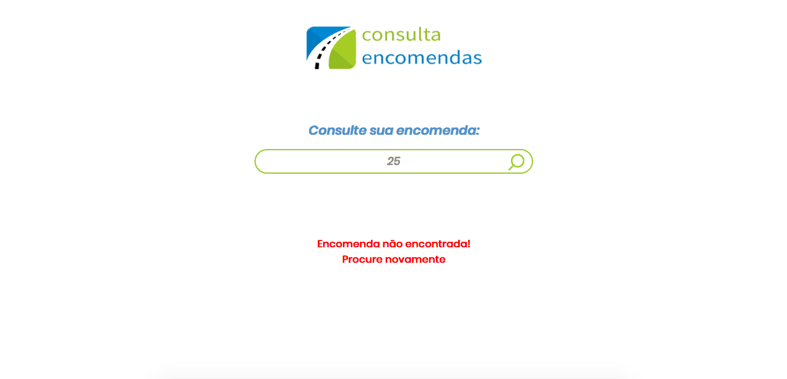
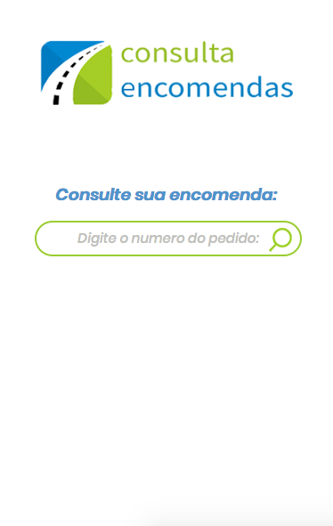
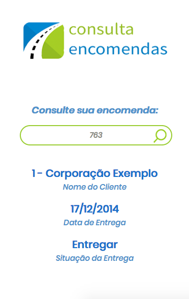
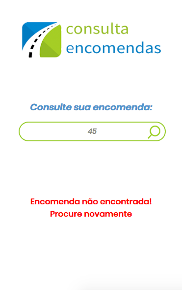

## Application development for delivery consultation

In this project, we can check if a delivery was completed or not. The search is made with the Delivery Id. 

## How to run this project

**Developement Environment**

- clone the project
- npm install - to install the dependencies.
- node server.js to start server 

**Production Environment**

gulp - to automate tasks and prepare the production environment